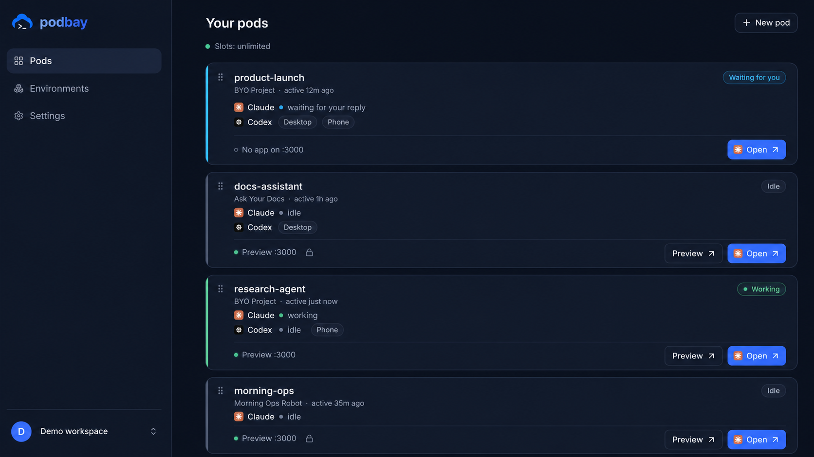

<div align="center">

# podbay

**Give an agent a computer — on your own metal.**

Persistent, disposable cloud workspaces for coding agents (Claude Code, Codex): a real Linux box per
task, with a browser dashboard, a live terminal, and instant previews. Self-host it in one command, or
use the managed service at [podbay.cloud](https://podbay.cloud).

[](LICENSE)
[](#quickstart-self-host)

<br>



</div>

## Why podbay

An agent is only as capable as the computer you give it. podbay gives each agent a **persistent pod** —
its own filesystem, tools, ports, and network — that survives restarts, runs 24/7, and shows you exactly
what it's doing through a dashboard and a live terminal. Point it at a repo, hand it an API key or your
subscription login, and it works like a teammate with their own machine.

- **A real box per task** — not a sandbox toy; full Docker workspace, your tools, your ports.
- **Live previews** — anything on `:3000` gets a shareable (or private) URL.
- **Watch and steer** — dashboard + web terminal; the agent runs while you're away.
- **Your metal, your keys** — self-host on a laptop or a server; bring your own Anthropic API key or
  Claude subscription. Nothing leaves your machine that you didn't send.

## Quickstart (self-host)

You need **Docker** (Desktop or Engine + Compose v2), ~**8 GB RAM**, ~**6 GB disk**, and either a
**Claude Pro/Max subscription** or an **Anthropic API key**. Works on macOS, Linux, and WSL2.

```sh
curl -fsSL https://raw.githubusercontent.com/podbay-cloud/install/main/install.sh | sh
```

The installer checks your machine, writes a Docker Compose setup into `./podbay`, pulls the prebuilt
images, and prints **the real URL for your setup** — it auto-detects where it runs:

- **Laptop / private box** → `http://localhost:8080`
- **Public server, no domain** → automatic HTTPS at `https://<your-ip>.sslip.io` (each pod gets its own
  `https://<pod>.<your-ip>.sslip.io` preview)
- **Your domain** → `https://podbay.<your-domain>` (two DNS records)

Open the URL → **Create a pod** → connect your agent → you're in. No repo clone, no build required —
the one-liner pulls prebuilt images. (Prefer to build them yourself? See [below](#build-from-source).)

## What you get

| | |
|---|---|
| **Pods** | persistent Docker workspaces, one per task, that survive restarts |
| **Agents** | Claude Code and Codex, on your subscription or a BYO API key |
| **Dashboard** | create/observe/suspend pods; each shows agent state at a glance |
| **Terminal** | a real browser terminal into every pod |
| **Previews** | live `:3000` previews, public or owner-only |
| **Environments** | ready-made workspace templates + a skills/rules layer |

## Build from source

The prebuilt images are the default. To build your own (air-gapped, customized, or latest `main`):

```sh
git clone https://github.com/podbay-cloud/podbay.git && cd podbay
# build the pod-base image (the pod runtime) and the app image, then run the compose stack
./selfhost/build-images.sh          # multi-arch build → your registry
# ...then point the compose at your images (see selfhost/)
```

See [`selfhost/`](selfhost/) for the compose file, environment variables, and the deployment guide.

## What's in this repo

A pnpm monorepo:

- **`packages/pod-agent`** — the in-pod runtime: terminal bridge, supervisor/watchdog, the in-pod
  `podbay` CLI, dev-server management.
- **`packages/provider`** — the pod backend behind one interface (`local` = Docker for self-host);
  **`packages/provider/pod-base`** is the image (Dockerfile, init, CLI, skills).
- **`packages/control-plane`** — the pod lifecycle service (single-tenant for self-host).
- **`packages/gateway`** — the terminal/preview link.
- **`packages/db`**, **`packages/auth`**, **`packages/shared`**, **`packages/selfhost`** — schema
  (Postgres/PGlite), single-owner auth, shared schemas, the self-host serve daemon.
- **`apps/web`** — the dashboard (one edition-aware app).
- **`environments/`**, **`skills/`** — workspace templates and the agent skill/rule layer.

## Managed cloud

Don't want to run infrastructure? [**podbay.cloud**](https://podbay.cloud) is the hosted version — the
same runtime, plus a managed fleet, team features, and a residential-egress relay network.

## License

podbay is **[Business Source License 1.1](LICENSE)**: free to self-host for yourself or your
organization, and it **converts to Apache-2.0 three years** after each release. The one restriction is
offering podbay as a competing hosted service. Plain-English summary: [`LICENSING.md`](LICENSING.md).

## Contributing & security

- Contributions welcome — see [`CONTRIBUTING.md`](CONTRIBUTING.md) (PRs are validated upstream; a DCO
  sign-off is required).
- Found a vulnerability? Please report it privately — see [`SECURITY.md`](SECURITY.md).
